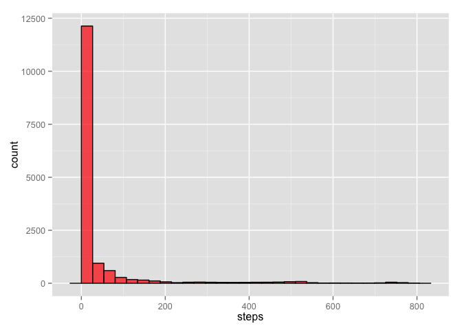
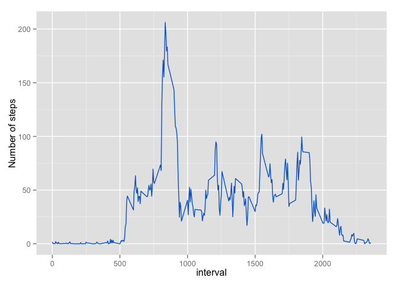
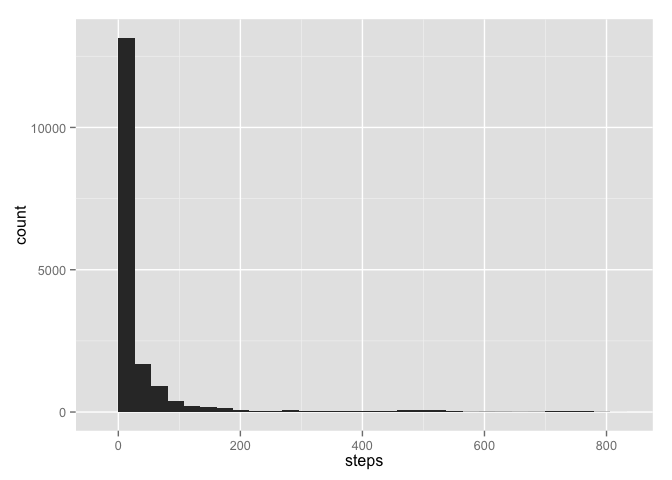

# Reproducible Research: Peer Assessment 1


## Loading and preprocessing the data

```
## Warning: package 'dplyr' was built under R version 3.1.2
```

```
## 
## Attaching package: 'dplyr'
## 
## The following object is masked from 'package:stats':
## 
##     filter
## 
## The following objects are masked from 'package:base':
## 
##     intersect, setdiff, setequal, union
```

```r
setwd("~/Desktop/datasciencecoursera/Reproducible Research/RepData_PeerAssessment1")
data = read.csv("activity.csv")
```

## What is mean total number of steps taken per day?

```r
ggplot(data) + geom_histogram(aes(x = steps), fill = "red", alpha = ".7", color = "black")
```

```
## stat_bin: binwidth defaulted to range/30. Use 'binwidth = x' to adjust this.
```

 

```r
with(data, mean(steps, na.rm = TRUE))
```

```
## [1] 37.3826
```

```r
with(data, median(steps, na.rm = TRUE))
```

```
## [1] 0
```

## What is the average daily activity pattern?


```r
steps_by_interval = data %>% group_by(interval) %>% summarize(avg_steps = mean(steps, na.rm = T)) 
ggplot(steps_by_interval) + geom_line(aes(x = interval, y = avg_steps), color = "#0268D4") +
  ylab("Number of steps")
```

 

```r
arrange(steps_by_interval, desc(avg_steps))[1,]$interval
```

```
## [1] 835
```
## Imputing missing values
Number of incomplete cases:

```r
sum(!complete.cases(data))  
```

```
## [1] 2304
```


```r
data_new = data %>% 
  full_join(steps_by_interval, by = c("interval" = "interval")) %>% 
  mutate(steps = ifelse(is.na(steps), avg_steps, steps), weekday = ifelse(weekdays(as.Date(date)) %in% c("Saturday", "Sunday"), "weekend", "weekdays" ))

ggplot(data_new) + geom_histogram(aes(x = steps))
```

```
## stat_bin: binwidth defaulted to range/30. Use 'binwidth = x' to adjust this.
```

 

```r
with(data_new, mean(steps))
```

```
## [1] 37.3826
```

```r
with(data_new, median(steps))
```

```
## [1] 0
```

## Are there differences in activity patterns between weekdays and weekends?

```r
ggplot(data_new %>% group_by(weekday, interval) %>% summarize(avg_steps_day = mean(steps))) + 
  geom_line(aes(x = interval, y= avg_steps_day), color="#0268D4") + 
  facet_grid(weekday~.) + 
  ylab("Number of Steps")
```

 

