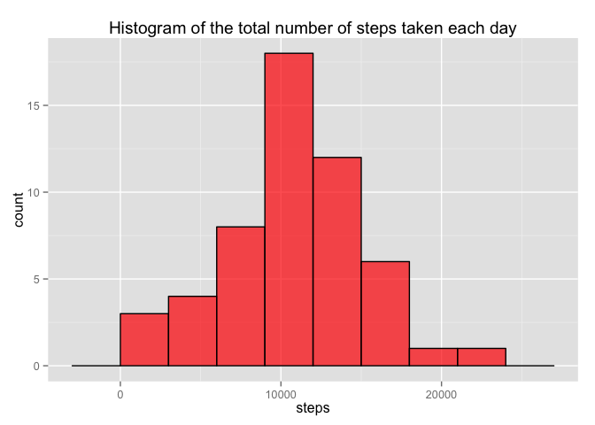
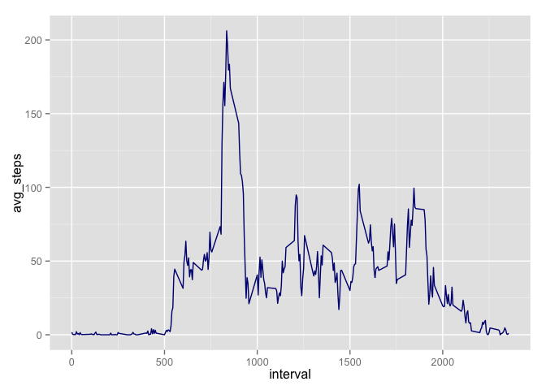
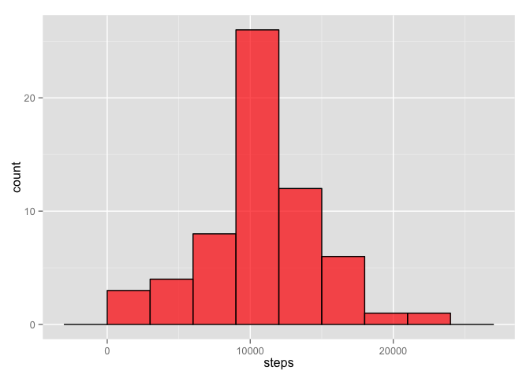
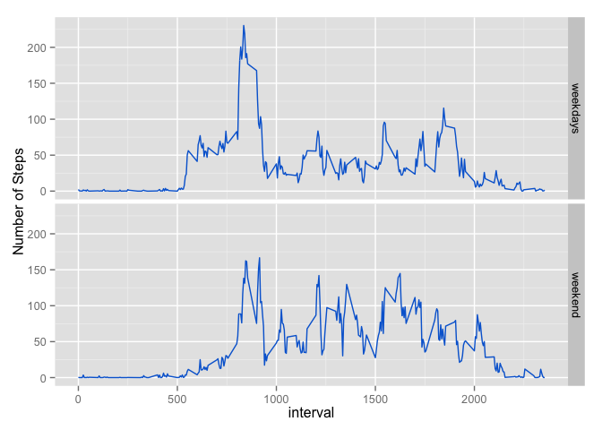

# Reproducible Research: Peer Assessment 1

## Loading and preprocessing the data

1. Load activity data:

```r
setwd("~/Documents/git/datasciencecoursera/Reproducible Research/RepData_PeerAssessment1")
data = read.csv("activity.csv")
```
2. Make necessary tranformations:

```r
data$date = as.Date(data$date)
```
## What is mean total number of steps taken per day?
1. Histogram of the total steps per day:

```r
steps_by_day = data %>% na.omit() %>% group_by(date) %>% summarize(steps = sum(steps, na.rm = T)) 

ggplot(steps_by_day) + 
  geom_histogram(aes(x = steps), fill = "red", alpha = ".7", color = "black", binwidth = 3000)
```

 

2. Computing the mean and median:

```r
with(steps_by_day, mean(steps, na.rm = TRUE))
```

```
## [1] 10766.19
```

```r
with(steps_by_day, median(steps, na.rm = TRUE))
```

```
## [1] 10765
```

## What is the average daily activity pattern?
1. Time series plot of the average steps by interval:

```r
steps_by_interval = data %>% group_by(interval) %>% summarize(avg_steps = mean(steps, na.rm = T)) 
ggplot(steps_by_interval) + geom_line(aes(x = interval, y = avg_steps), color = "#0268D4") +
  ylab("Number of steps")
```

 

```r
arrange(steps_by_interval, desc(avg_steps))[1,]$interval
```

```
## [1] 835
```
2. Interval with the maximum number of steps: 

```r
arrange(steps_by_interval, desc(avg_steps))[1,]$interval
```

```
## [1] 835
```
## Imputing missing values
1. Number of incomplete cases:

```r
sum(!complete.cases(data))  
```

```
## [1] 2304
```

2. The strategy that I will follow to fill in all of the missing values in the dataset, is replacing each by the mean for that 5-minute interval. 

3. Replacing the NA values, and calculating the total steps per day:

```r
data_new = data %>% 
  full_join(steps_by_interval, by = c("interval" = "interval")) %>% 
  mutate(steps = ifelse(is.na(steps), avg_steps, steps))

steps_by_day_new = data_new %>% group_by(date) %>% 
  summarize(steps = sum(steps, na.rm = T)) 

ggplot(steps_by_day_new) + 
  geom_histogram(aes(x = steps), fill = "red", alpha = .7, color="black", binwidth = 3000)
```

 

```r
with(steps_by_day_new , mean(steps))
```

```
## [1] 10766.19
```

```r
with(steps_by_day_new , median(steps))
```

```
## [1] 10766.19
```

4. In the original data set, the mean and median are slightly different. In the new data set, the mean and median are the same.

## Are there differences in activity patterns between weekdays and weekends?
1. We compute the variable **weekday** that indicates whether a given date is a weekday or weekend day.

```r
data_new = data_new %>% 
  mutate(weekday = ifelse(weekdays(date) %in% c("Saturday", "Sunday"), "weekend", "weekdays" ))
```
2. The next plot shows a timeline with the 5-minute intervals vs the average number of steps taken, averaged across all weekday days or weekend days:

```r
ggplot(data_new %>% group_by(weekday, interval) %>% summarize(avg_steps_day = mean(steps))) + 
  geom_line(aes(x = interval, y= avg_steps_day), color="#0268D4") + 
  facet_grid(weekday~.) + 
  ylab("Number of Steps")
```

 

